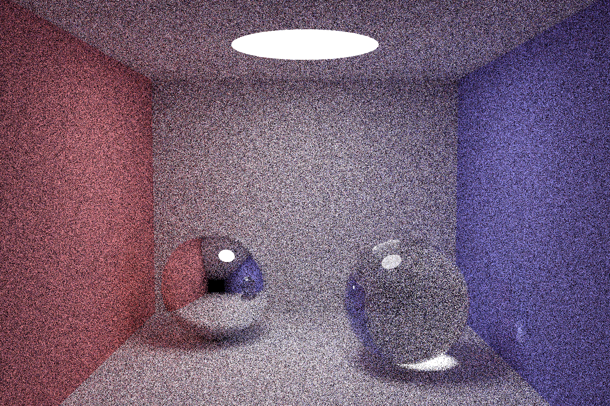

# pocketpt
A single-source GLSL path tracer in [111 lines of code](pocketpt.cpp), based on [Kevin Beason's smallpt](http://kevinbeason.com/smallpt).

## Usage 

Platform: Windows

Make: `g++ -O3 pocketpt.cpp -o pocketpt -lopengl32 -lgdi32`

Run:  `./pocketpt <samplesPerPixel=1000> <y-resolution=400>`

## Output

The following shows the result renderings at 1080p resolution and different number of samples per pixel achieved on a Core i7-8565U CPU with Intel UHD 620 Onboard Graphics (click to enlarge).

| |  |  | 
------- | ------- | ------- | -------- | ---------
16 spp  | 80 spp  | 400 spp | 2000 spp | 10000 spp
6 sec   | 25 sec  | 114 sec | 10 min   | 48 min 

## Implementation Notes

The GLSL path tracing code is generally performed in float precision, with the exception the sphere intersection code in lines `59` - `61`, which uses double-precision. This precision is required due to the huge radii of spheres used for the Cornell box construction. When using smaller spheres or other primitives to define the boundary planes, one can change these lines to float precision, which comes with a considerable performance speedup. However, the code was published as is for better comparability and to better comply with Kevin Beason's original scene definition.

## 
Special Thanks go to Peter Houska.
